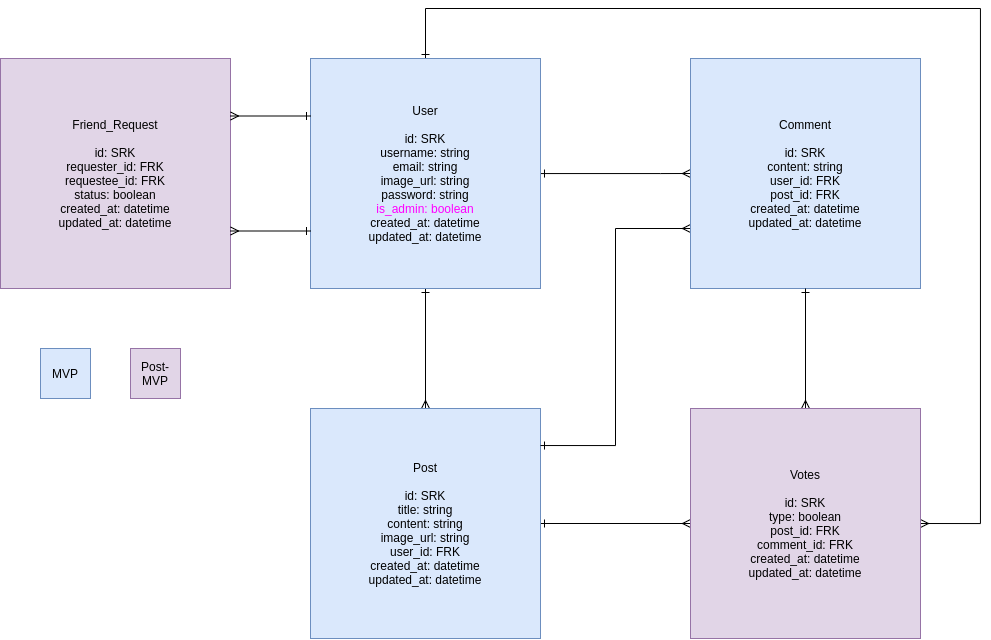

# Hubbub README

- [Overview](#overview)
- [MVP](#mvp)
  - [Goals](#goals)
  - [Libraries and Dependencies](#libraries-and-dependencies)
  - [Client (Front End)](#client-front-end)
    - [Wireframes](#wireframes)
    - [Component Tree](#component-tree)
    - [Component Architecture](#component-architecture)
    - [Time Estimates](#time-estimates)
  - [Server (Back End)](#server-back-end)
    - [ERD Model](#erd-model)
- [Post-MVP](#post-mvp)
- [Code Showcase](#code-showcase)
- [Code Issues & Resolutions](#code-issues--resolutions)

<br>

---

## Overview

_**Hubbub** is a blog app where users can post their thoughts on life and the world and interact with one another. Users are able to comment and give their thoughts on other users' posts, as well as like, upvote, and downvote posts._

<br>

---

## MVP

_Users are able to sign up/sign in for an account and receive a JWT. Once signed in, they will be able to read, create, edit, and delete their own posts, and comment on other users' posts._

<br>

---

### Goals

- _Create models, routes, and controllers for users, posts, and comments using Ruby on Rails_
- _Authentication for users and JWT creation_
- _Connect to a React front-end that displays user info, posts, and comments_
- _Style using Material UI_

<br>

---

### Libraries and Dependencies

|     Library      | Description                                                            |
| :--------------: | :--------------------------------------------------------------------- |
| Create React App | _Used to create front-end of app_                                      |
| React Router Dom | _Route, Link, useParams, useHistory_                                   |
|      Axios       | _Used to make and send front-end requests to Rails back-end_           |
|   Material-UI    | _Used styled components and library to style front-end_                |
|  Ruby on Rails   | _Used to create back-end logic and database_                           |
|    PostgreSQL    | _Used as the primary development and production database_              |
|       Cors       | _Used to connect front-end requests to back-end server logic_          |
|      Bcrypt      | _Security measure to hash passwords and encode/decode JWT payloads_    |
|       JWT        | _Used to create JSON web tokens for authenticated users_               |
|      Faker       | _Used to create seed data during development_                          |
|       Pry        | _Used to create a cleaner display in rails console during development_ |

<br>

---

### Client (Front End)

#### Wireframes

[Wireframe Link](https://www.figma.com/file/ji0NXEE6NgiOgYCkHKjSij/hubbub?node-id=14%3A581 'wireframe link')

- Mobile - Home Screen


- Mobile - Sign Up


- Mobile - View Posts


- Mobile - View Post With Comments


- Mobile - Create Post


- Mobile - Create Comment


<br>

---

#### Component Tree

[Component Tree Link](https://whimsical.com/hubbub-component-hierarchy-BZsJ6GimeVKv5PrkmAwgax 'Component Tree Link')


<br>

---

#### Component Architecture

```structure

src
|__ assets/
      |__ fonts
      |__ images
|__ helper/
      |__ sort.js
      |__ search.js
|__ components/
      |__ BackButton.jsx
      |__ CommentCard.jsx
      |__ Footer.jsx
      |__ Header.jsx
      |__ PostCard.jsx
|__ containers/
      |__ PostsContainer.jsx
|__ layout/
      |__ Layout.jsx
|__ screens/
      |__ CommentCreate.jsx
      |__ CommentUpdate.jsx
      |__ Home.jsx
      |__ PostCreate.jsx
      |__ PostDetail.jsx
      |__ Posts.jsx
      |__ PostUpdate.jsx
      |__ UserLogin.jsx
      |__ UserRegister.jsx
      |__ UserUpdate.jsx
      |__ UserUpdatePassword.jsx
|__ services/
      |__ api-config.js
      |__ comments.js
      |__ images.js
      |__ posts.js
      |__ users.js
|__ App.js

```

<br>

---

#### Time Estimates

| Task                   | Priority | Estimated Time | Actual Time | Time Invested |
| ---------------------- | :------: | :------------: | :---------: | :-----------: |
| Define models          |    H     |      1 hr      |    2 hrs    |     2 hrs     |
| Define controllers     |    H     |      2 hr      |    5 hrs    |     7 hrs     |
| Define routes          |    H     |      1 hr      |    3 hrs    |    10 hrs     |
| Define screens logic   |    H     |     6 hrs      |    8 hrs    |    18 hrs     |
| Define component logic |    H     |     3 hrs      |    2 hrs    |    20 hrs     |
| Define services logic  |    H     |     2 hrs      |    2 hrs    |    22 hrs     |
| Define container logic |    H     |     3 hrs      |    2 hrs    |    24 hrs     |
| Define layout logic    |    H     |      1 hr      |    1 hr     |    25 hrs     |
| Base CSS with MUI      |    H     |     3 hrs      |    6 hrs    |    31 hrs     |
| Define helper logic    |    H     |     2 hrs      |     DNF     |    31 hrs     |
| Define 'friend' logic  |    H     |     3 hrs      |     DNF     |    31 hrs     |
| Advanced styling       |    H     |     20 hrs     |    2hrs     |    33 hrs     |
| TOTAL                  |          |     47 hrs     |    3 hrs    |    33 hrs     |

<br>

---

### Server (Back End)

#### ERD Model



<br>

---

## Post-MVP

- _Add likes, upvotes, and downvotes for comments and posts_
- _Add admin property for users_
- _Allow users to send friend requests and accept friend requests_
- _Allow users to upload profile pics from local directories_
- _Add search bar that filters posts_
- _Add sort options to search posts by category_

<br>

---

## Code Showcase

> The below code is an async function to handle deleting comments. It makes a single axios DELETE request, and updates 3 separate screens. The Home, Posts, and Post Detail screens all reflect the updated comment count / displayed comments without any additional axios GET requests.

<br>
```

const handleCommentDelete = async (post_id, comment_id) => {
await deleteComment(post_id, comment_id)
setToggle(false)
setComments(prevState => prevState.filter(comment => comment.id !== comment_id))

      const associatedPost = posts.find(post => post.id === post_id)
      const deletedCommentIndex = associatedPost.comments.findIndex(comment => comment.id === comment_id)
      associatedPost.comments.splice(deletedCommentIndex, 1)

      setPosts(prevState => prevState.map(post => {
            return post.id === post_id ? associatedPost : post
      }))

      setToggle(true)

}

```
---

## Code Issues & Resolutions

> Due to the limited api calls made, the main issues were battling async functions that were updating State, and then rendering through mapped arrays. Optional chaining was helpful as well as conditional rendering of a loading element.
```
